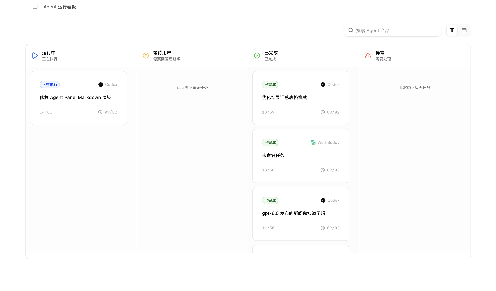
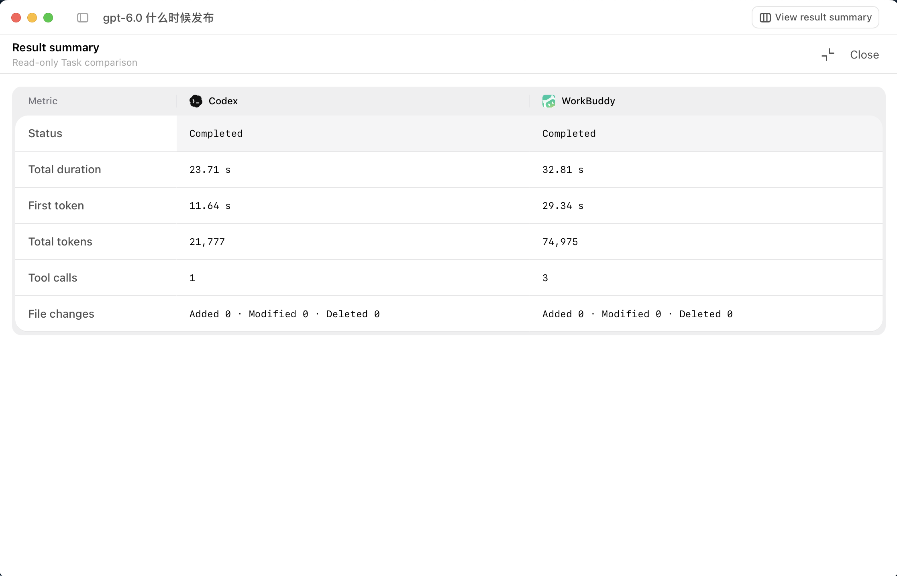

  

  <h1></h1>

  
<strong>English</strong> | <a href="./README.zh-CN.md">简体中文</a>

  
<strong>Put every AI agent on the same starting line</strong>

  
A local-first desktop workspace for parallel AI coding agents and reproducible evaluations

  
<strong>Privacy first. All data stays local, with application records stored in SQLite.</strong>

  

    
    
    
    
    
  

  

    <a href="#product-preview">Product Preview</a> ·
    <a href="#highlights">Highlights</a>
  

---

## Product Preview

<table>
  <tr>
    <td colspan="2" align="center">
      
       
      Run multiple agents on the same task and follow their status, responses, and tool calls in real time
    </td>
  </tr>
  <tr>
    <td width="50%" align="center">
      
       
      Monitor every Agent task at a glance with searchable lifecycle columns
    </td>
    <td width="50%" align="center">
      
       
      Compare completion, latency, token usage, tool calls, and file changes side by side
    </td>
  </tr>
  <tr>
    <td width="50%" align="center">
      
       
      Manage skills centrally and mount them into workspaces
    </td>
    <td width="50%" align="center">
      
       
      Organize reproducible benchmark comparisons
    </td>
  </tr>
</table>

## About Theoria

Theoria is a desktop workspace for AI coding agents. It gives every selected agent the same workspace snapshot and an isolated execution directory, allowing Codex, Claude Code, OpenCode, and WorkBuddy to solve one task in parallel while their progress, results, and file changes remain easy to compare.

It supports everyday multi-agent development workflows and provides consistent environments, run history, and skill configuration for repeatable capability evaluations.

> [!WARNING]
> This project is not yet complete and remains under active development.

## Highlights

| Capability | Description |
| --- | --- |
| Parallel agents | Run up to six agents on one task, including Codex, Claude Code, OpenCode, and WorkBuddy |
| Isolated execution | Start from an immutable workspace snapshot and give each agent its own working directory |
| Observable progress | Follow status, streaming output, tool calls, token usage, and duration; stop one agent or all of them |
| Continued collaboration | Preserve agent sessions and send follow-up prompts to every agent or a selected subset |
| Result comparison | Collect final responses and file changes, then persist run history for later review |
| Skill management | Manage skills from local or Git sources and mount them into one or more workspaces |
| Benchmark workflows | Organize reproducible comparisons around fixed snapshots, test cases, and selected agents |
| Local-first data | Keep workspaces on the local file system and persist application records in SQLite |
| Internationalization | Use the built-in Simplified Chinese and English interfaces with localized frontend and backend errors |
