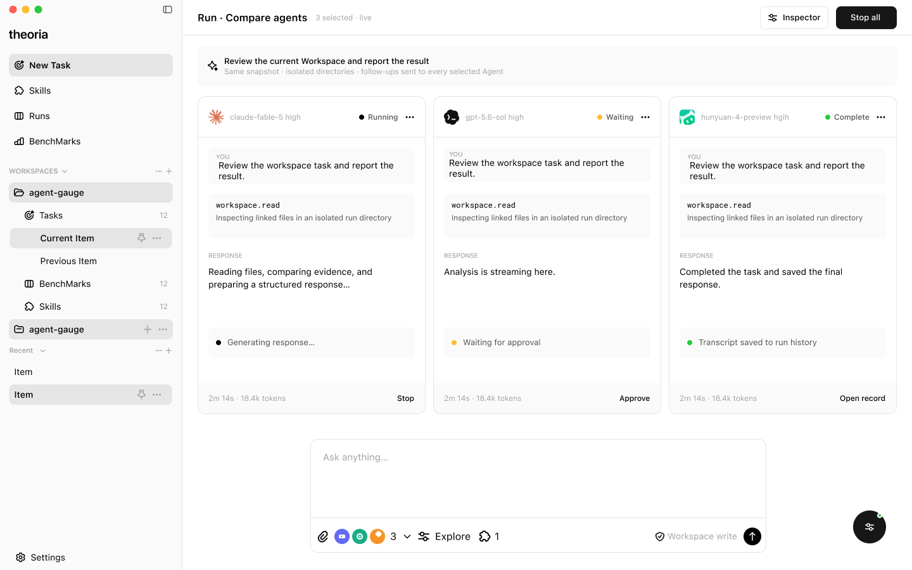
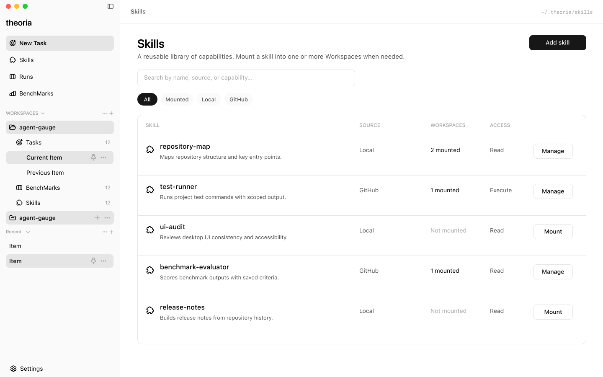
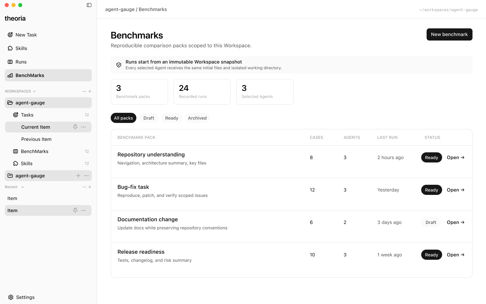

<div align="center">
  

  <h1>Theoria</h1>
  <p><strong>让多个 AI Agent 在同一起跑线上解决问题</strong></p>
  <p>本地优先的 AI 编程 Agent 并行运行与可复现评测工作台</p>

  <p>
    
    
    
    
    
  </p>

  <p>
    <a href="#产品预览">产品预览</a> ·
    <a href="#功能亮点">功能亮点</a> ·
    <a href="#快速开始">快速开始</a> ·
    <a href="#开发指南">开发指南</a> ·
    <a href="#项目结构">项目结构</a> ·
    <a href="#构建与发布">构建与发布</a>
  </p>
</div>

---

## 产品预览

<table>
  <tr>
    <td colspan="2" align="center">
      <a href="./assets/page1.png">
        
      </a>
      <br />
      <sub>在同一任务中并行运行多个 Agent，实时查看状态、回复与工具调用</sub>
    </td>
  </tr>
  <tr>
    <td width="50%" align="center">
      <a href="./assets/page2.png">
        
      </a>
      <br />
      <sub>集中管理并按 Workspace 挂载 Skills</sub>
    </td>
    <td width="50%" align="center">
      <a href="./assets/page3.png">
        
      </a>
      <br />
      <sub>组织可复现的 Benchmark 对比任务</sub>
    </td>
  </tr>
</table>

## 关于 Theoria

Theoria 是一款面向 AI 编程 Agent 的桌面工作台。它会为每个候选 Agent 创建相同的 Workspace 快照和相互隔离的执行目录，让 Codex、Claude Code、OpenCode 与 WorkBuddy 能够并行处理同一任务，并将过程、结果和文件变更放在一个界面中对比。

它既适合日常开发中的多 Agent 协作，也为可重复执行的能力评测提供一致的运行环境、历史记录和 Skills 配置。

> [!NOTE]
> Theoria 目前处于积极开发阶段，界面和数据结构仍可能调整。

## 功能亮点

| 能力 | 说明 |
| --- | --- |
| 多 Agent 并行 | 在同一任务中选择最多 6 个 Agent，并行运行 Codex、Claude Code、OpenCode 与 WorkBuddy |
| 隔离执行环境 | 从不可变 Workspace 快照启动，每个 Agent 使用独立工作目录，避免相互污染 |
| 过程可观测 | 实时查看运行状态、流式输出、工具调用、Token 用量与耗时，并可单独或批量停止 |
| 连续协作 | 保留 Agent 会话上下文，支持针对全部或指定 Agent 继续追问 |
| 结果对比 | 汇总最终回复与文件变更，持久化运行记录，便于回看不同 Agent 的表现 |
| Skills 管理 | 管理本地或 Git 来源的 Skills，并按需挂载到一个或多个 Workspace |
| Benchmark 工作流 | 围绕固定快照、测试用例与候选 Agent 组织可复现的对比任务 |
| 本地优先 | 基于 Tauri 运行，Workspace、任务记录和评测数据保存在本机 |
| 国际化 | 内置简体中文和英文界面，前后端错误信息均支持本地化 |

## 快速开始

### 环境要求

- Node.js 与 Corepack
- Rust stable 工具链
- [Tauri 2 对应平台的系统依赖](https://v2.tauri.app/start/prerequisites/)
- pnpm 11（项目会通过 Corepack 使用 `package.json` 中声明的版本）
- 至少安装并登录一个受支持的本地 Agent CLI

### 启动开发环境

```bash
git clone <repository-url>
cd theoria
corepack enable
pnpm install
pnpm tauri dev
```

首次启动后，添加一个本地 Workspace，选择已就绪的 Agent，即可创建并运行任务。

## 开发指南

### 常用命令

| 命令 | 用途 |
| --- | --- |
| `pnpm tauri dev` | 启动 Tauri 桌面开发环境 |
| `pnpm dev` | 仅启动 Vite 前端开发服务器 |
| `pnpm test` | 运行 Vitest 测试 |
| `pnpm test:coverage` | 生成前端测试覆盖率 |
| `pnpm typecheck` | 检查前端与 Node 配置类型 |
| `pnpm check` | 运行 Biome 格式与代码检查 |
| `cargo check --manifest-path src-tauri/Cargo.toml` | 检查 Rust 后端 |
| `pnpm build` | 执行类型检查并构建前端 |

提交前建议运行完整检查：

```bash
pnpm check
pnpm test
pnpm build
cargo check --manifest-path src-tauri/Cargo.toml
```

## 项目结构

```text
theoria/
├── assets/                 # README 品牌素材与产品截图
├── src/
│   ├── api/                # Tauri IPC 调用与响应校验
│   ├── components/         # 通用界面组件
│   ├── i18n/               # 前端国际化资源
│   ├── pages/              # Task、Runs、Skills、Benchmarks 等页面
│   ├── queries/            # TanStack Query 数据访问层
│   ├── routers/            # 应用路由
│   └── types/              # 前端领域类型与 Zod Schema
├── src-tauri/
│   ├── src/adapters/       # 各 Agent CLI 与系统能力适配器
│   ├── src/commands/       # 暴露给前端的 Tauri Commands
│   ├── src/repositories/   # SQLite 持久化访问层
│   ├── src/services/       # 任务、快照、执行与结果领域服务
│   └── tauri.conf.json     # 桌面窗口与打包配置
└── package.json
```

## 构建与发布

生成当前平台的桌面安装包：

```bash
pnpm tauri build
```

构建产物默认位于：

```text
src-tauri/target/release/bundle/
```

发布前请确认目标平台的签名、证书和安装包配置已经就绪；不同平台的安装包应在对应系统或 CI Runner 上分别构建。
